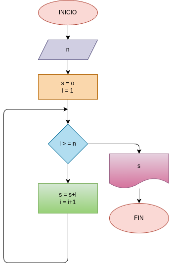

# While_1
Programa de instrucciones repetitivas, halla la suma de los n primeros números naturales.

# Analisis

 ## Input 
 n
 
 ### Variables de entrada 
 n: número al que se aplica la formula.
 
 ### Processing

 s: valor inicial de la suma (0).

i: siguiente dijito a sumar (+1).

mientras i <= n:

s = s + i

i = i + 1
 

 ## Output
 s
 
 # Diseño 
  
 

 # Construcion

        